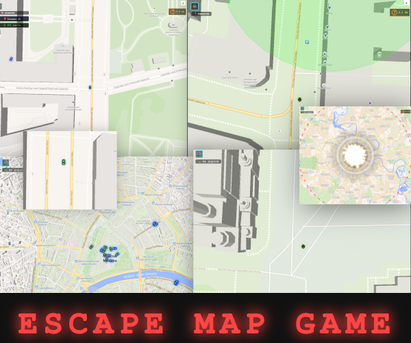

# Escape Map Game

[](https://evgenykon.github.io/escape-map-game/)

A browser-based escape game (MapLibre + Vue 3) where the player must reach a shelter before an explosion. The map is rendered using OpenFreeMap tiles with real buildings, roads, and terrain.



> All commands must be run **only via `make`**. Direct execution of `npm` / `vite` / `bun` is forbidden — the environment must be isolated in Docker.

## Stack

| Layer | Technology |
|---|---|
| Language | TypeScript |
| Bundler | Vite 5 |
| UI | Vue 3 (Composition API) |
| State | Pinia |
| Map | MapLibre GL JS |
| Geo analysis | Turf.js |
| Map tiles | OpenFreeMap (Liberty style) |
| Containerization | Docker + docker compose |

## Requirements

- Docker 24+
- Docker Compose v2 (`docker compose ...`)
- Make
- Free port `3001` (dev) and/or `80` (production)

## Structure

```
.
├── AGENTS.md              # project rules (takes precedence over README)
├── Makefile               # all run scenarios
├── docker-compose.yml     # dev and production services
├── Dockerfile             # production build (multi-stage → nginx)
├── Dockerfile.dev         # dev image (node:24-alpine + Vite HMR)
├── nginx.conf             # SPA fallback
├── vite.config.ts         # @ alias → src, base for GH_PAGES
├── index.html
├── public/                # static assets (sprites, sounds, icons)
└── src/
    ├── main.ts            # Vue + Pinia bootstrap
    ├── App.vue
    ├── components/        # StartScreen, LoadingScreen, GameScreen
    ├── stores/game.ts     # Pinia game state store
    ├── scenarios/         # scenario definitions (nuclear, types, registry)
    └── engine/
        ├── MapEngine.ts        # MapLibre init, layers, markers
        ├── OverpassLoader.ts   # loading orchestration, preload sprites
        ├── PlayerController.ts # player & car movement, interactions
        ├── CarPhysics.ts       # acceleration, braking, drift, fuel
        └── SoundEngine.ts      # sound effects management
```

## Quick Start

### 1. Dev mode (hot-reload)

```bash
make dev
```

Starts the `frontend-dev` container:
- inside: Vite dev-server on `5173`
- exposed: `http://localhost:3001`
- sources are mounted as a volume (`./:/app`), changes apply without restart
- dependencies (`node_modules`) live in a named anonymous volume and are not overwritten by the host

Stop: `Ctrl+C`, then `docker compose down` (or `docker compose down -v` to reset the `node_modules` volume).

### 2. Production build and run

```bash
make build     # docker build of the frontend image (production profile)
make run       # start nginx container in the background on port 80
```

After `make run` the game is available at `http://localhost/`.

Stop:

```bash
docker compose --profile production down
```

### 3. Type checking

```bash
make typecheck
```

Runs `vue-tsc --noEmit` in a dedicated container. Checks TypeScript and Vue templates without building artifacts.

### 4. Deploy to GitHub Pages

```bash
make deploy-gh-pages
```

Builds `dist/` (with `base: '/escape-map-game/'`), switches to the `gh-pages` branch, pushes the artifact, and returns to `main`. Requires a clean working tree and push access to `origin`.

## Makefile Commands

| Command | Description |
|---|---|
| `make dev` | Starts the dev container with HMR on `:3001` |
| `make typecheck` | Runs `vue-tsc --noEmit` |
| `make build` | Builds the production `frontend` image (multi-stage) |
| `make run` | Starts the production `frontend` container in the background on `:80` |
| `make deploy-gh-pages` | Build + deploy `dist/` to the `gh-pages` branch |

## How to Play

1. On the start screen, pick a **scenario** (e.g. nuclear strike) and choose a **location** — either allow browser geolocation or pick a city from the list. Click **"Старт"**.
2. The game loads the map and preloads sprites and sounds. The **epicenter** is placed 1 km from your position in a random direction.
3. A single **shelter** is selected among buildings within a 1.5–2 km ring from the epicenter. An evacuation zone is marked on the map.
4. Cars are placed nearby — some may be driven (press **E** to interact), locked cars can be **hacked** (hold **E** near them).
5. Controls:
   - **W / A / S / D** — movement
   - **Shift** — run
   - **E** — interact (enter/exit car, start/cancel hack)
   - **M** — cycle map modes (follow, overview, tactical)
   - mouse — camera rotation
6. HUD: countdown timer, scenario‑specific SMS and thoughts, shelter compass, fuel gauge, surface type indicator.
7. At the moment of the explosion: if the player is **inside** the shelter — win, otherwise — lose.

Vehicles have fuel and physics (drift, off-road penalty). You can refuel at fuel stations.

## Environment Variables

| Variable | Where | Purpose | Default |
|---|---|---|---|
| `GH_PAGES` | `frontend` build arg | Enables `base: '/escape-map-game/'` in Vite | `1` |
| `NODE_ENV` | `frontend-dev` | Node environment | `development` |

Override: `GH_PAGES=0 make build`.

## Useful Commands

```bash
# dev container logs
docker compose logs -f frontend-dev

# shell into the dev container
docker compose run --rm --entrypoint sh frontend-dev

# rebuild the dev image from scratch
docker compose build --no-cache frontend-dev
```

## Rules and Limitations

- Running `npm run dev`, `npx vite`, or similar commands **directly** is forbidden — only through `make` targets.
- Any changes to `src/` are picked up by HMR in dev mode without restarting the container.
- Always run `make typecheck` before submitting a PR.

Details in [AGENTS.md](./AGENTS.md).
